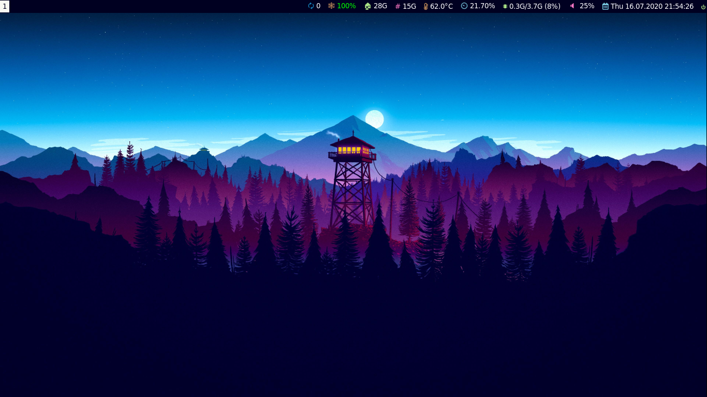
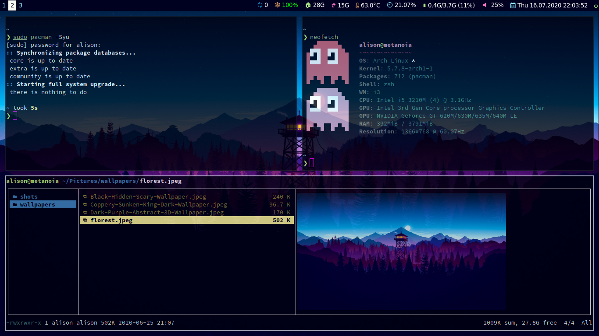
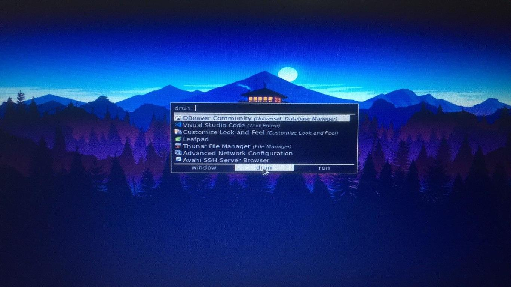

### Arch Linux [i3-gaps + i3blocks + Zsh + Ranger + Rofi + Neofetch]

---

### Welcome to my dotfiles! :space_invader:

**For the Shell:**

| Package                                                    | Description                                                         |
| ---------------------------------------------------------- | ------------------------------------------------------------------- |
| [Arch Linux](https://www.archlinux.org/)                   | The best distro ever!                                               |
| [Termite](https://github.com/thestinger/termite)           | A keyboard-centric VTE-based terminal emulator                      |
| [Zsh](https://github.com/zsh-users/zsh)                    | The most powerful shell out there!                                  |
| [Oh My Zsh](https://github.com/ohmyzsh/ohmyzsh)            | Community-driven framework for managing your zsh configuration      |
| [Zsh](https://github.com/zsh-users/zsh)                    | The most powerful shell out there!                                  |
| [Termite Style](https://github.com/adi1090x/termite-style) | A Simple Program To Change Colors And Fonts Of Termite In Real Time |
| [Neofetch](https://github.com/dylanaraps/neofetch)         | A fast, highly customizable system info script                      |
| [Nerd Fonts](https://github.com/ryanoasis/nerd-fonts)      | Fonts patched with lots of amazing icons (I use Source Code Pro)    |

---

**For the window manager:**

| Package                                                                   | Description                                                                       |
| ------------------------------------------------------------------------- | --------------------------------------------------------------------------------- |
| [i3-gaps](https://github.com/Airblader/i3)                                | i3wm with more features                                                           |
| [i3blocks](https://github.com/vivien/i3blocks)                            | A replacement for the default i3status with more features                         |
| [Nerd Fonts](https://github.com/ryanoasis/nerd-fonts)                     | Fonts patched with lots of amazing icons (I use Source Code Pro)                  |
| [Rofi](https://github.com/DaveDavenport/rofi)                             | A window switcher, application launcher and dmenu replacement                     |
| [Compton](https://github.com/chjj/compton)                                | A compositor for X, to get window transparency and avoid tearing and vsync issues |
| [Feh](https://github.com/derf/feh)                                        | Image viewer, useful to set a wallpaper                                           |
| [pacman-contrib](https://www.archlinux.org/packages/?name=pacman-contrib) | Contributed scripts and tools for pacman systems                                  |

---

### i3 tiling capabilities:

## 

### 
